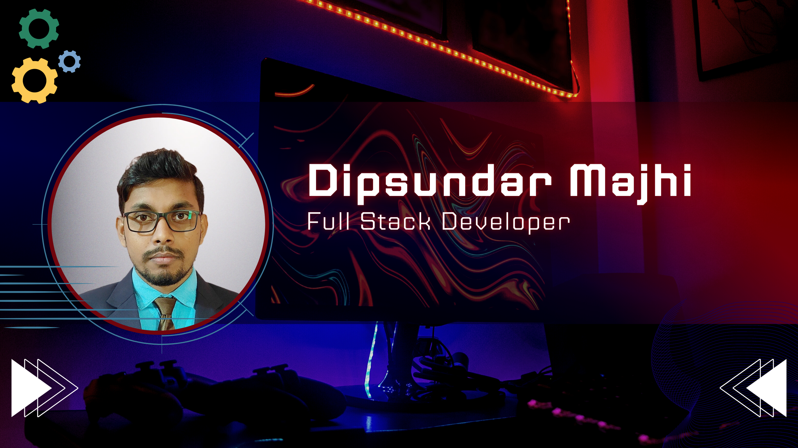
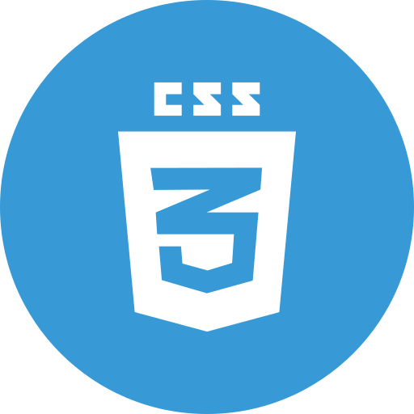

<!-- banner image starts here  -->

  

<!-- banner image ends here  -->

<h1>👋 Hello, I'm Dipsundar Majhi</h1>

&nbsp;A **👨‍💻Web Developer** 💻  
🏠 &nbsp; Living: Bankura, West Bengal, India

 

<!-- Contact me section starts here  -->
<!-- [][website] -->

[][linkedin]
[][gmail]
[][facebook]
[][telegram]
[][whatsapp]

 
 

---

<!-- Contact me section ends here  -->

<!-- about-me section starts here  -->

### 👨‍🏫 &nbsp; About Me

I am a Web Developer & self-taught programmer with problem solving skills and also ability to perform well in a team. Passionate about coding and enjoy helping others. After completing my Bachelor in Technology in Computer Science and Engineering, in 2022, I am improving my web development skills. Every day I want to learn something new.

 
<!-- about-me section ends here  -->

<!-- web related skills section starts here  -->

### 👨🏽‍💻 &nbsp; My Skills:

#### Key Skills:

 
 
 

<!-- web related skills section ends here  -->

<!-- other skills section start here  -->

#### Other Skills:

 
 
 
<!-- other skills section ends here -->

<!-- tools section start here  -->

#### Tools:

 
 
 
<!-- tools section ends here  -->

<!-- github stats starts here  -->

 

<!-- github stats ends here  -->

<!-- education section starts here  -->

### 👨🏻‍🎓 &nbsp; Education

1. B. Tech. in Computer Science and Engineering  
   Supreme Knowledge Foundation Group of Institutions  
   MAKAUT University  
   2018 - 2022  
   CGPA: 8.57

2. Higher Secondary Education in Pure Science
   Indas High School  
   WBCHSE Board  
   2016 - 2018  
   Percentage: 70.2%

3. Secondary Education  
   Gurudham Santasram Brahmananda Vidyabhaban  
   WBBSE Board  
   2010 - 2016  
   Precentage: 77.85%

 

<!-- education section ends here  -->

<!-- my languages section starts here  -->

### Languages:

- Bengali : Native
- English : Intermediate
- Hindi : Intermediate

   

<!-- my languages section ends here  -->

<!-- my sports and game section starts here  -->

### Sports / Game / Activities / Hobby:

- Cricket, Football
- Running, Walking
- Travelling

 
<!-- my sports and games section ends here  -->

<!-- ## Contact:
Email id: **dipsundarmajhi@gmail.com**
WhatsApp: [Chat with me](https://wa.me/7602061928) -->

---

## &copy;All rights reserved by Dipsundar Majhi - 2024

<!-- Links section starts here -->

<!-- [website]: http://www.dipsundar.com/ -->

[facebook]: https://www.facebook.com/MajhiDipsundar
[linkedin]: https://www.linkedin.com/in/dipsundar-majhi-3a47171a3
[github]: https://github.com/Dipsundar
[WhatsApp]: https://wa.me/7602061928
[gmail]: https://www.dipsundarmajhi@gmail.com
[telegram]: https://t.me/DIPSUNDARMAJHI
